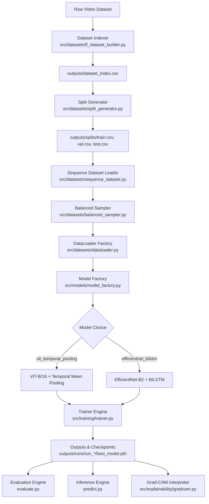
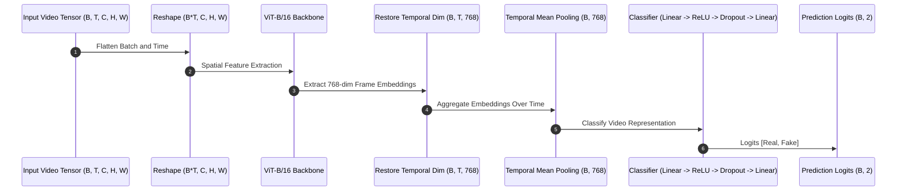
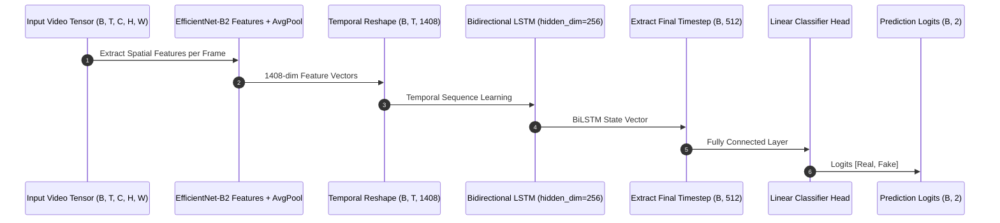

# DeepVision AI — System Architecture

> Modular, Explainable Deepfake Detection Architecture using Vision Transformers, Temporal Pooling, and Grad-CAM Interpretability.

---

## 1. System Overview & Data Flow

---

## 2. Core Model Architecture: ViT-B/16 + Temporal Mean Pooling

---

## 3. Alternate Model Architecture: EfficientNet-B2 + BiLSTM

---

## 4. Source Code Component Mapping

- **Datasets Layer (`src/datasets/`)**: Handles video indexing, stratified splitting, sequence loading (`.npy`), balanced sampling, and DataLoader creation.
- **Models Layer (`src/models/`)**: Abstract `BaseModel`, `ViTTemporalPooling`, `EfficientNetBiLSTM`, and `ModelFactory`.
- **Training Layer (`src/training/`)**: Handles training/validation loops, early stopping, optimizer/scheduler creation, checkpoint management, state tracking, and logging.
- **Evaluation Layer (`evaluate.py`)**: Metrics calculator (Accuracy, Precision, Recall, F1, ROC-AUC), confusion matrix generator, classification report exporter, and prediction CSV serializer.
- **Explainability Layer (`src/explainability/`)**: Grad-CAM visual heatmap generator and overlay renderer.
- **Inference Layer (`predict.py`, `src/inference/`)**: Multi-clip temporal predictor for standalone single video analysis.